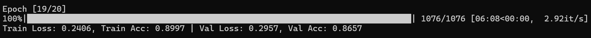
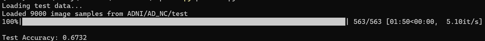
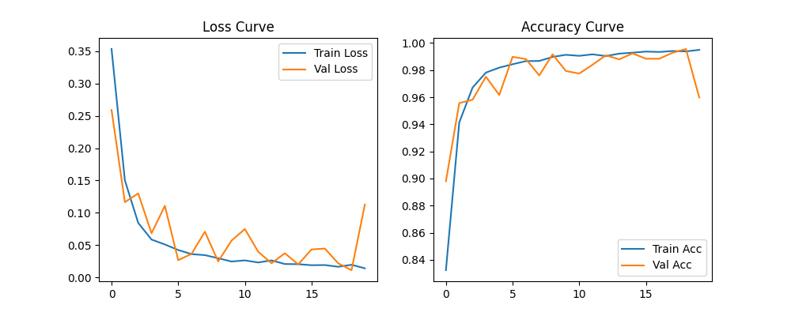
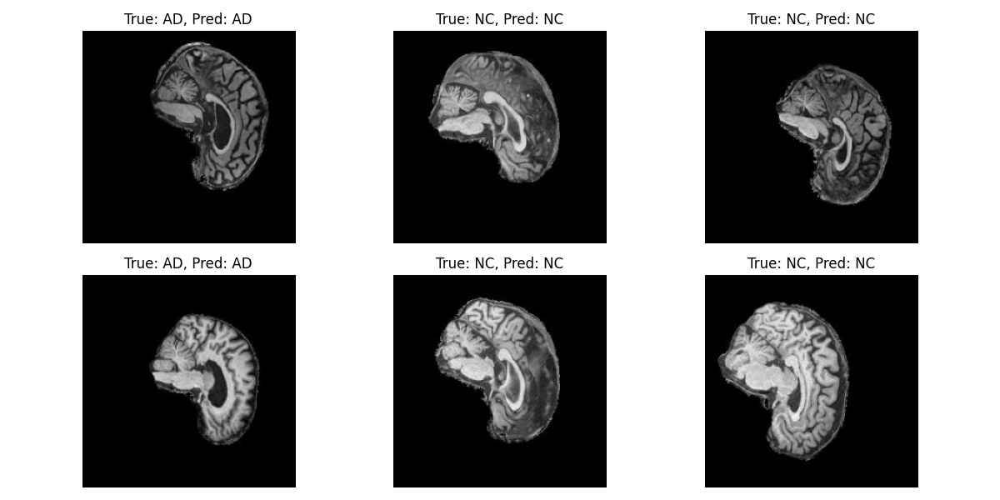

#  ADNI Alzheimer’s Disease Classification using Custom ConvNeXt Network

##  Problem Description

Alzheimer’s Disease (AD) is a progressive neurodegenerative disorder that affects memory and cognitive function.  
This project focuses on **binary classification of AD vs Normal Controls (NC)** using 2D MRI slices from the **ADNI brain imaging dataset**.  
The objective is to design and train a deep neural network that can automatically learn discriminative imaging biomarkers for Alzheimer’s detection.  

---

##  Algorithm Description

A **ConvNeXt-Tiny** convolutional architecture was **implemented from scratch in PyTorch** to perform image classification on MRI slices.  
ConvNeXt is a modernized convolutional network architecture that achieves Transformer-like performance while retaining CNN simplicity.  
It replaces traditional bottleneck residual blocks with **depthwise separable convolutions**, **LayerNorm normalization**, and **GELU** activation,  
enabling efficient feature extraction with fewer parameters and improved stability.  

The model takes 2D MRI images as input, applies multiple ConvNeXt blocks for hierarchical feature extraction,  
then uses **global average pooling** followed by a fully connected linear layer to output the probabilities of AD or NC.  

---

##  How It Works

1. **Data Loading** – MRI slices are loaded using a custom `ADNIDataset` class that reads from:
2.  **Pre-processing** – Images are resized to `224×224`, normalized to `[-1, 1]`, and augmented with random flips and rotations.  
These augmentations improve generalization and reduce overfitting.  
The normalization step follows standard practice for convolutional architectures (Isensee et al., BRATS 2017).

3. **Training** –  
- **Optimizer:** AdamW  
- **Learning Rate:** 1e-4  
- **Batch Size:** 16  
- **Epochs:** 20  
- **Loss Function:** CrossEntropyLoss  
- **Validation Split:** 20% of training data for model selection and overfitting detection.

4. **Model Selection** – The model achieving the highest validation accuracy is saved as `checkpoints/best_model.pth`.

5. **Inference** – The best model is loaded in `predict.py` to evaluate test accuracy and generate visualizations of sample predictions.

---

## Inputs and Outputs examples

- Using **py train.py** in powershell/cmd can similarly get data like upload ones

**Trainning screenshot**

- Using **py predict.py** in powershell/cmd can get outputs of prediction.

**Predicting screenshot**

---

##  Figures & Visualizations

**Training & Validation Curves:**

**Sample Prediction Results:**

---

##  Data Splitting and Reproducibility

- **Training / Validation Split:** 80/20 using `torch.utils.data.random_split`.  
  - Training: Model parameter optimization.  
  - Validation: Hyperparameter tuning and early stopping decision.  
- **Testing:** Independent test set (`ADNI/AD_NC/test`) used only for final performance evaluation.  
- **Reproducibility:**  
  - Fixed random seeds in PyTorch and NumPy.  
  - Deterministic splits ensured identical results between runs.  
  - Model weights and training curves saved in `/checkpoints`.

